# וטרינריה
## תוכן עניינים

1. [שלב 1](#שלב-1)
   - [ERD](#ERD)
   - [DSD](#DSD)
   - [תיאור תרשים](#תיאור-תרשים)
   - [טבלאות לפי שיטות הכנסה שונות](#טבלאות-לפי-שיטות-הכנסה-שונות)

2. [שלב 2](#שלב-2)
   - [Select Queries](#select-queries)
   - [Delete Queries](#delete-queries)
   - [Update Queries](#update-queries)
   - [Constraints queries](#constraints-queries)

3. [שלב 3](#שלב-3)
   - [Functions](#functions)
   - [Procedures](#procedures)
   - [Main programs](#main-programs)

4. [שלב 4](#שלב-4)
   - [ERD & DSD](#ERD)
   - [Integration decisions](#החלטות-בשלב-האינטגרציה)

# שלב 1

הוטרנריה מקבלת חיות מחמד לביקורים אצל הוטרינר, לבדיקות ולטיפולים שונים. אפשר לקנות מוצרים נוספים אצל המזכירות.
  הארגון דואג לאגד את כל הנתונים הנצרכים על מנת שהטיפול יתבצע בצורה היעילה ביותר.

ERD:
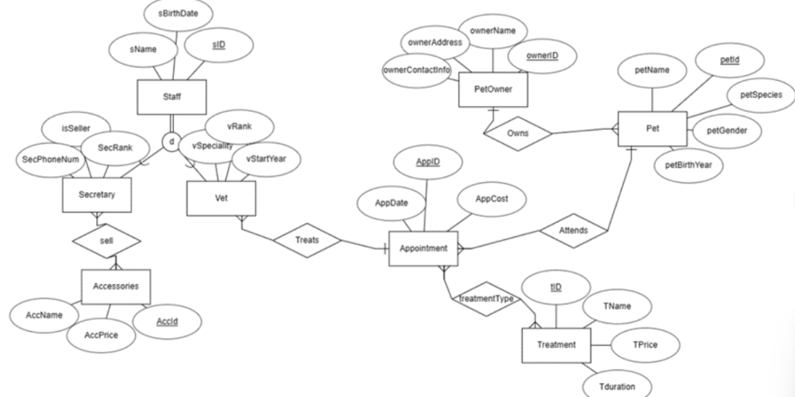

DSD:


## תיאור תרשים

### Staff
**ישות: איש צוות**
- **sName**: שם של איש צוות
- **sID**: מספר מזהה ת"ז של איש צוות

תיאור: הישויות וטרינר ומזכירה יורשות מהישות של איש צוות.

### Vet
**ישות: וטרינר**
- **sName**: שם של איש צוות
- **sID**: מספר מזהה ת"ז של איש צוות
- **vSpeciality**: התמחות
- **vStartYear**: שנת התחלה
- **vRank**: דרגה

### Secretary
**ישות: מזכירה**
- **sName**: שם של איש צוות
- **sID**: מספר מזהה ת"ז של איש צוות
- **secRank**: דרגה
- **secPhoneNum**: מספר טלפון
- **secIsSeller**: שדה בוליאני ליכולתה למכור

תיאור: היא נמצאת ביחס עם הישות אקססוריז שבה מצויינים פריטים שהמרפאה מוכרת.
### Sell
**ישות: מכירה**
- **AccID**: מספר מזהה של מוצר
- **sID**: מספר מזהה ת"ז של מזכירה

### Accessories
**ישות: אקססוריז**
- **AccPrice**: מחיר פריט
- **AccId**: מספר מזהה של פריט

### Appointment
**ישות: ביקור**
- **AppDate**: תאריך
- **AppID**: מספר מזהה
- **AppCost**: עלות

### Treatment
**ישות: טיפול**
- **tID**: מספר מזהה
- **TName**: שם טיפול
- **Tprice**: עלות
- **Tduration**: זמן
  
### TreatmentType
**ישות: סוג טיפול**
- **tID**: מספר מזהה של טיפול
- **appID**: מספר מזהה של ביקור

### Pet
**ישות: חייה מטופלת**
- **petName**: שם
- **petId**: מספר מזהה
- **petSpecies**: זן
- **petGender**: מין
- **petAge**: שנת לידה

### PetOwner
**ישות: בעלים של החייה המטופלת**
- **ownerID**: ת"ז
- **ownerName**: שם
- **ownerAddress**: כתובת
- **ownerContactInfo**: פרטי קשר

desc:

.png)
.png)

## טבלאות לפי שיטות הכנסה שונות:
  
### text import
PetOwner:
  
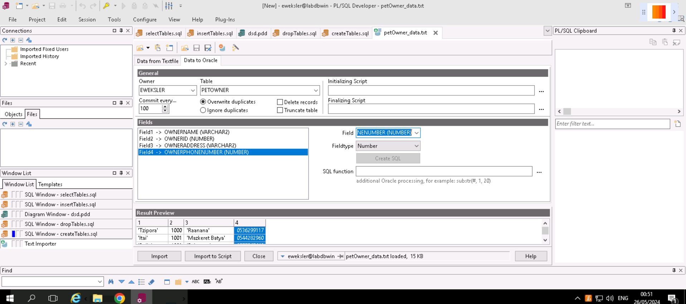
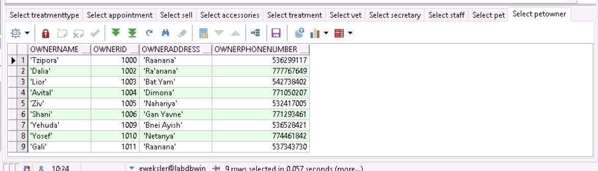

### data generator
Accessories:

.jpeg)
.jpeg)
.jpeg)

Appointment:
.jpeg)
.jpeg)
.jpeg)

Secretary:
.jpeg)
.jpeg)
.jpeg)

Sell:
.jpeg)
.jpeg)
.jpeg)

Treatment Type:
.jpeg)
.jpeg)
.jpeg)

Treatment:
.jpeg)

### python generated sql
Pet:
.png)
.png)

Staff:
.png)
.png)

### Backup
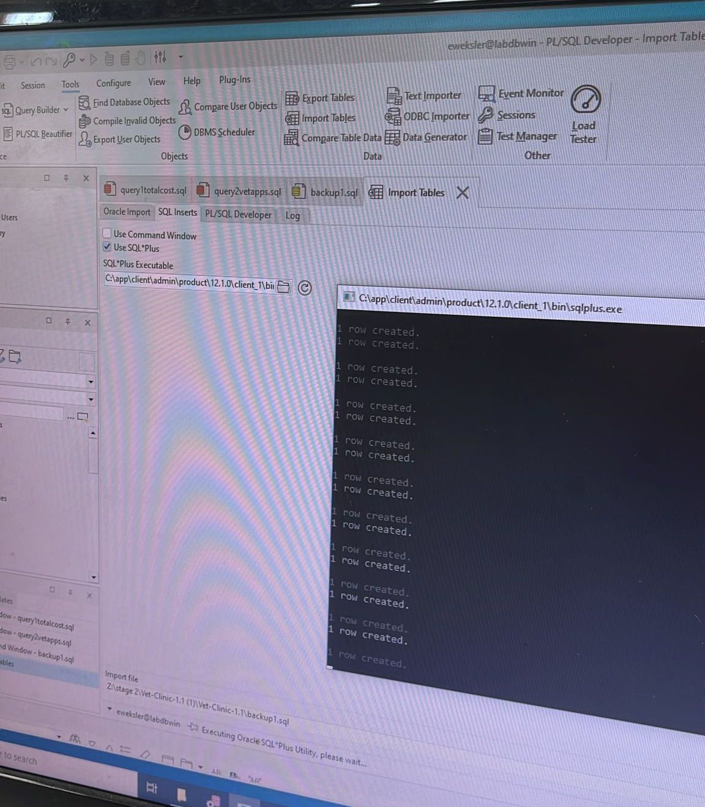


# שלב 2
## Select Queries
### Without parameters
החזרת מידע על כל המזכירות המוכרות, המוצר שהן מוכרות ופרטי תקשורת איתן
.jpeg)

סכום עלות כל הטיפולים של בעלי החיה עבור על חיית מחמד שלו
.jpeg)

סוג הטיפול עבור כל חיית מחמד, התאריך והוטרינר המטפל
.jpeg)

מספר הביקורים שנקבעו אצל כל וטרינר
.jpeg)

### With parameters
החזרת פרטי בעלים מסויים, חיות המחמד שלו שצריכות לעבור טיפול מסויים ומתי התור שלהן.
.jpeg)

"קבלה" על קניית המוצרים, והסכום הכולל של הקניה
.jpeg)

החזרת פרטי כל חיות המחמד שיש להן ביקור עם הוטרינר המסויים
.jpeg)

החזרת כל הוטרינרים שיש חיות מחמד אצלם בביקור בין התאריכים המסויימים
.jpeg)

החזר את כל פרטי הקשר עם בעלים לפי בחירת שמות בשיטת checklist
.jpeg)

## Delete Queries
הסרת תמיכת הוטרינריה בטיפולים בדגי קרב (בטא).
זה כולל הסרת הטיפולים המיוחדים להם, ביטול התורים לדגים אלו, והסרת הדגים מרשימת המטופלים.
- לפני:
.jpeg)
- אחרי:
.jpeg)

הסרת כל המזון הרטוב (wet food).
- לפני:
.jpeg)
- אחרי:
.jpeg)

## Update Queries
דחיית כל התורים שבשנת 2023 לשנת 2024.
- לפני:
.jpeg)
- אחרי:
.jpeg)

הנחה על כל מוצרי האוכל, אותו מאפשרות רק מזכירות לא-מתחילות.
- לפני:
.jpeg)
- אחרי:
.jpeg)


## Constraints queries
- אילוץ: ברירת מחדל עבור מזכירה היא "לא" מוכרת.
- אילוץ: מחיר מוצר יהיה מ0 ומעלה, לא שלילי.
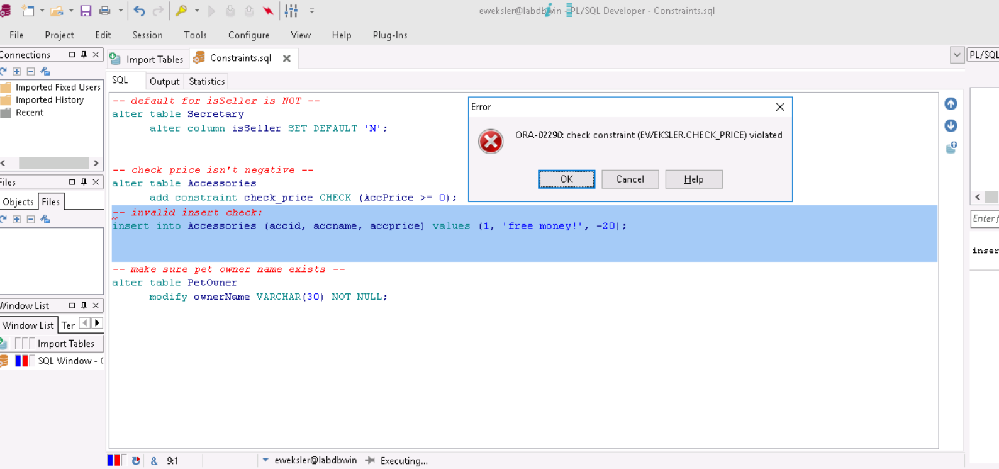
- אילוץ: שם בעלים חייב להיות קיים ולא נאל.
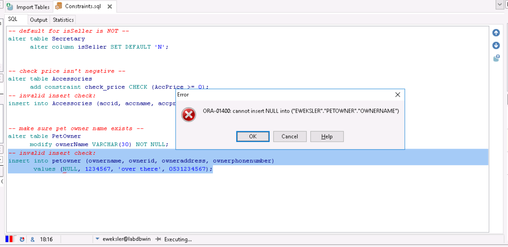


# שלב 3
## Functions
חישוב סכום עלויות הטיפולים לפי תז של בעלים
```sql
CREATE OR REPLACE FUNCTION calculate_total_cost(p_owner_id INTEGER)
RETURN NUMBER
IS
    v_owner_id PetOwner.ownerID%TYPE;
    v_total_cost NUMBER := 0;
BEGIN
    -- Check if owner exists
    SELECT ownerID
    INTO v_owner_id
    FROM PetOwner
    WHERE ownerid = p_owner_id;

    -- Cursor to fetch appointments for the owner
    FOR appointment_rec IN (
        SELECT AppCost
        FROM Appointment a
        WHERE EXISTS (
            SELECT 1
            FROM Pet p
            WHERE p.petId = a.petId
            AND p.ownerID = v_owner_id
        )
    ) LOOP
        v_total_cost := v_total_cost + appointment_rec.AppCost;
    END LOOP;

    RETURN v_total_cost;
EXCEPTION
    WHEN NO_DATA_FOUND THEN
        DBMS_OUTPUT.PUT_LINE('Owner of id ' || p_owner_id || ' not found.');
        RETURN 0;
    WHEN OTHERS THEN
        DBMS_OUTPUT.PUT_LINE('An error occurred: ' || SQLERRM);
        RETURN NULL;
END;
```

החזר את הביקורים של חיות המחמד של בעלים מסויים
```sql
CREATE OR REPLACE FUNCTION get_owner_appointments(p_owner_id INTEGER)
RETURN SYS_REFCURSOR
IS
    v_owner_id PetOwner.ownerID%TYPE;
    v_ref_cursor SYS_REFCURSOR;
BEGIN
    SELECT ownerID
    INTO v_owner_id
    FROM PetOwner
    WHERE ownerid = p_owner_id;

    OPEN v_ref_cursor FOR
        SELECT AppID, AppDate, AppCost
        FROM Appointment a
        WHERE EXISTS (
            SELECT 1
            FROM Pet p
            WHERE p.petId = a.petId
            AND p.ownerID = v_owner_id
        );

    RETURN v_ref_cursor;
EXCEPTION
    WHEN NO_DATA_FOUND THEN
        DBMS_OUTPUT.PUT_LINE('Owner of id ' || p_owner_id || ' not found.');
        RETURN NULL;
    WHEN OTHERS THEN
        DBMS_OUTPUT.PUT_LINE('An error occurred: ' || SQLERRM);
        RETURN NULL;
END;
```

מספר החיות בוטרינריה מזן מסויים
```sql

CREATE OR REPLACE FUNCTION get_pet_count_by_species(p_species VARCHAR2)
RETURN NUMBER
IS
    v_count NUMBER;
    CURSOR pet_cursor IS
        SELECT COUNT(*) as pet_count
        FROM Pet
        WHERE petSpecies = p_species;
BEGIN
    OPEN pet_cursor;
    FETCH pet_cursor INTO v_count;
    CLOSE pet_cursor;
    
    RETURN v_count;
EXCEPTION
    WHEN OTHERS THEN
        DBMS_OUTPUT.PUT_LINE('An error occurred: ' || SQLERRM);
        RETURN NULL;
END;
```

## Procedures
עדכן מחיר לביקור מסויים
```sql

CREATE OR REPLACE PROCEDURE update_appointment_cost(p_app_id IN NUMBER, p_new_cost IN NUMBER)
IS
    v_pet_id NUMBER;
    v_owner_name VARCHAR2(30);
BEGIN
    -- Get pet ID and owner name for the appointment
    SELECT a.petId, o.ownerName
    INTO v_pet_id, v_owner_name
    FROM Appointment a
    JOIN Pet p ON a.petId = p.petId
    JOIN PetOwner o ON p.ownerID = o.ownerID
    WHERE a.AppID = p_app_id;

    -- Update appointment cost
    UPDATE Appointment
    SET AppCost = p_new_cost
    WHERE AppID = p_app_id;

    -- Output information
    DBMS_OUTPUT.PUT_LINE('Updated appointment cost for Pet ID: ' || v_pet_id);
    DBMS_OUTPUT.PUT_LINE('Owner Name: ' || v_owner_name);
    DBMS_OUTPUT.PUT_LINE('New Cost: ' || p_new_cost);

EXCEPTION
    WHEN NO_DATA_FOUND THEN
        DBMS_OUTPUT.PUT_LINE('Appointment not found.');
    WHEN OTHERS THEN
        DBMS_OUTPUT.PUT_LINE('An error occurred: ' || SQLERRM);
END;
```

הצג פרטי כל התורות של חיות בעלים מסויים
```sql
CREATE OR REPLACE PROCEDURE display_owner_appointments(p_owner_id INTEGER)
IS
    v_app_id Appointment.AppID%TYPE;
    v_app_date Appointment.AppDate%TYPE;
    v_app_cost Appointment.AppCost%TYPE;
    v_ref_cursor SYS_REFCURSOR;
BEGIN
    v_ref_cursor := get_owner_appointments(p_owner_id);

    IF v_ref_cursor IS NOT NULL THEN
        LOOP
            FETCH v_ref_cursor INTO v_app_id, v_app_date, v_app_cost;
            EXIT WHEN v_ref_cursor%NOTFOUND;
            DBMS_OUTPUT.PUT_LINE('Appointment ID: ' || v_app_id || ', Date: ' || TO_CHAR(v_app_date, 'YYYY-MM-DD') || ', Cost: ' || v_app_cost);
        END LOOP;
        
        CLOSE v_ref_cursor;
    ELSE
        DBMS_OUTPUT.PUT_LINE('No appointments found for owner of id ' || p_owner_id);
    END IF;
EXCEPTION
    WHEN OTHERS THEN
        DBMS_OUTPUT.PUT_LINE('An error occurred: ' || SQLERRM);
END;
```

## Main Programs
### Display Appointments and Total
הצג את פרטי כל התורות עבור חיות המחמד של בעלים מסויים, ואת הסכום הכולל
```sql
DECLARE
id1 petowner.ownerid%TYPE;
total INTEGER;
BEGIN
  id1 := 1200;
  total := 0;
    DBMS_OUTPUT.PUT_LINE('Appointments for Owner ID ' || id1 || ':');
    DBMS_OUTPUT.PUT_LINE('');
    display_owner_appointments(id1); -- procedure call
    DBMS_OUTPUT.PUT_LINE('');

    total := calculate_total_cost(id1); -- function call
    DBMS_OUTPUT.PUT_LINE('Total cost: ' || total);
        DBMS_OUTPUT.PUT_LINE('');    
END;
```
הרצה:

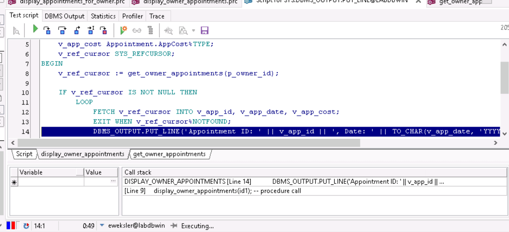
תוצאה:


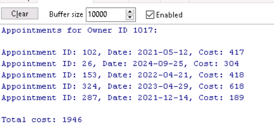
חריגה:

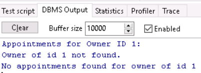

### Update Cost and Display Total
החזר מספר החיות בוטרינריה מזן מסויים, עדכן מחיר של תור מסויים, וחשב את הסכום הכללי שיעלה לבעלים בעקבות השינוי.
```sql
CREATE OR REPLACE PROCEDURE update_appointment_cost(p_app_id IN NUMBER, p_new_cost IN NUMBER)
IS
    v_pet_id NUMBER;
    v_owner_name VARCHAR2(30);
BEGIN
    -- Get pet ID and owner name for the appointment
    SELECT a.petId, o.ownerName
    INTO v_pet_id, v_owner_name
    FROM Appointment a
    JOIN Pet p ON a.petId = p.petId
    JOIN PetOwner o ON p.ownerID = o.ownerID
    WHERE a.AppID = p_app_id;

    -- Update appointment cost
    UPDATE Appointment
    SET AppCost = p_new_cost
    WHERE AppID = p_app_id;

    -- Output information
    DBMS_OUTPUT.PUT_LINE('Updated appointment cost for Pet ID: ' || v_pet_id);
    DBMS_OUTPUT.PUT_LINE('Owner Name: ' || v_owner_name);
    DBMS_OUTPUT.PUT_LINE('New Cost: ' || p_new_cost);

EXCEPTION
    WHEN NO_DATA_FOUND THEN
        DBMS_OUTPUT.PUT_LINE('Appointment not found.');
    WHEN OTHERS THEN
        DBMS_OUTPUT.PUT_LINE('An error occurred: ' || SQLERRM);
END;
```
הרצה:

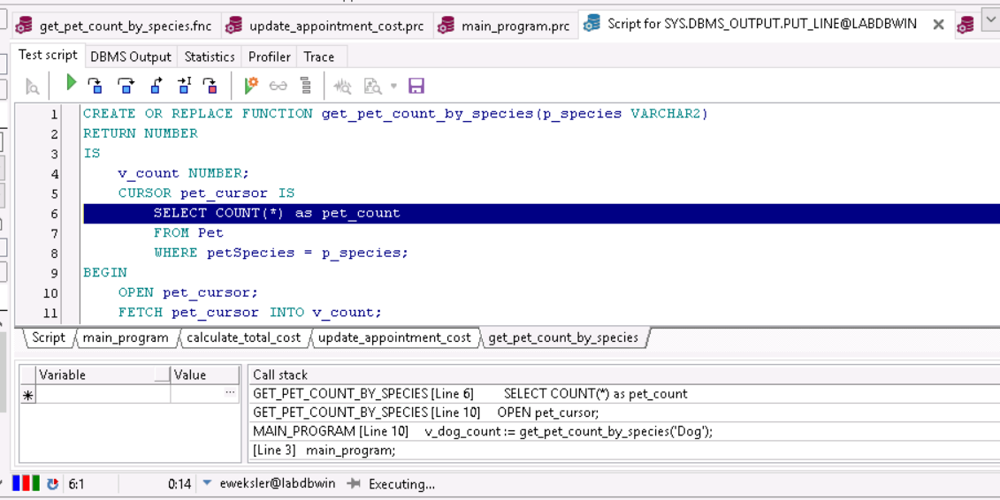
- לפני

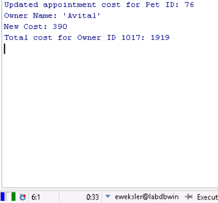
- אחרי

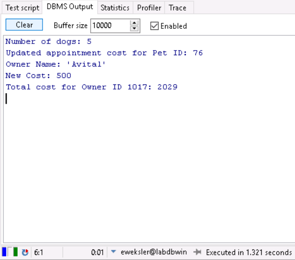

- השינוי בבסיס הנתונים:
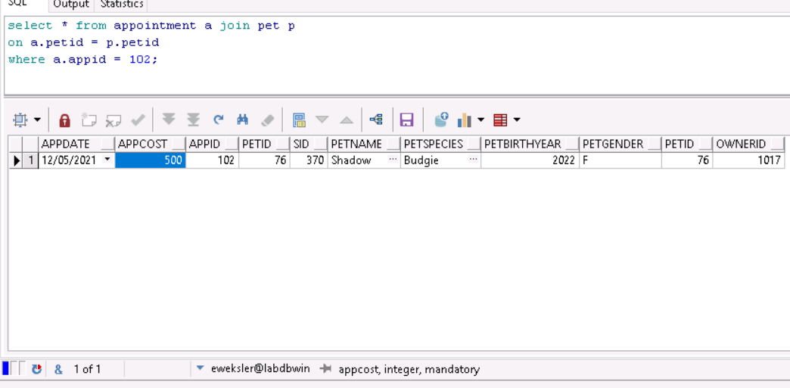

חריגת התוכנית בהרצה עם משתנה מסוג לא נכון:
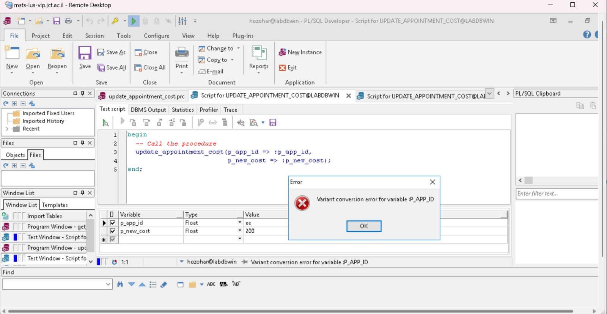

# שלב 4
## new ERD and DSD diagrams
### ERD


### DSD


## החלטות בשלב האינטגרציה
1. **מיזוג טבלאות PETOWNER ו-TRAVELERS**:
    - החלטנו למזג את טבלת PETOWNER עם טבלת TRAVELERS.
    - הוספנו את התכונה `YEAR_OF_BIRTH` שהייתה בטבלת TRAVELERS לטבלת PETOWNER.
    - התכונות `ID` ו-`NAME` של TRAVELERS הועברו לטבלת PETOWNER בהתאם.
    - בהתנגשויות של ID, השם (NAME) עודכן בהתאם לשם מהנתונים של האגף החדש.


2. **ירושת GUARD מ-STAFF**:
    - החלטנו שטבלת GUARD תירש מטבלת STAFF.
    - התכונות `ID` ו-`NAME` של GUARD הועברו לטבלת STAFF.
    - קישור הירושה נעשה באמצעות מפתח זר (FOREIGN KEY) לפי הת.ז.
    - בהתנגשויות של ID, השם (NAME) עודכן בהתאם לשם מהנתונים של האגף החדש.

